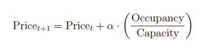
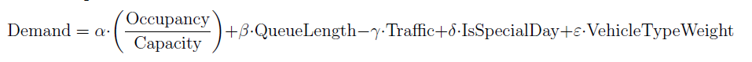
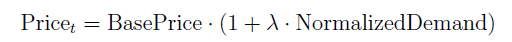
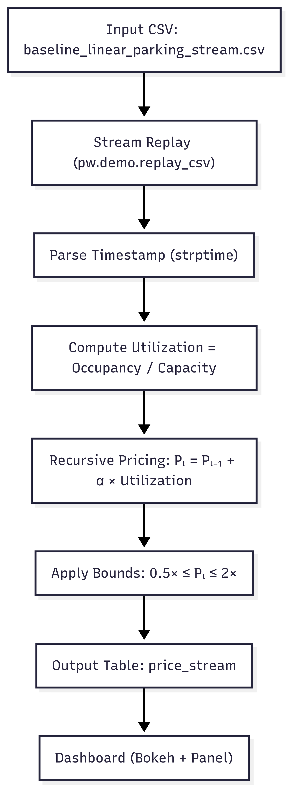
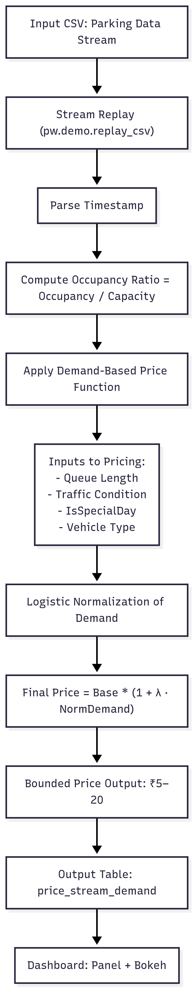

# Dynamic-Pricing-For-Urban-Parking-Lots
## Overview
#### This project utilizes a simulated real time data stream to build an intelligent, data-driven pricing engine for 14 parking spaces. The goal is to dynamically adjust parking prices based on real-time utilization, demand conditions, and competitive factors to facilitate revenue optimization. It implements three distinct pricing models using Pathway, a Python-native stream processing engine, and renders results using Bokeh and Panel dashboards. The data was sampled for 73 days at 18 time points per day with 30 minutes of time difference. 

#### The two pricing models used were:
### Baseline Linear Model: 
#### A simple model where the next price is a function of the previous price and current occupancy:

#### This model utilizes two features: Capacity and Occupancy. The price increases linearly as the ratio between occupancy and capacity increases. 

### Demand Based Pricing Model: 
#### This model estimates demand for parking slots using the features: Occupancy, Queue length, Traffic level, Special day and Vehicle type. This is a more nuanced model as it incorporates several variables which influences demand. The demand estimation function used is as follows:

#### The price is estimated as a function of the base price of $10 and the normalized demand estimated from the previous function. The demand estimate was normalized using sigmoid (logistic) function. The pricing formula is as follows:

## Tech Stack
#### Google Colab
#### Numpy
#### Pathway
#### Bokeh + Panel 

## Project Architecture
### Baseline Linear Model
#### The csv file of parking slot data is loaded and replayed as a simulated data stream using Pathway after defining schema. Timestamps are created and parsed and the ratio of occupancy to capacity, known as utilization is calculated. The pricing model is implamanted as a recursive stateful function and a Python dictionary is used to maintain the internal state. The price estimates are bounded at 0.5-2 times the baseline price to smooth fluctuations. 14 bokeh plots are used to visualize pricing plots in real time. The complete architecture diagram is as follows:

### Demand Based Pricing Model
#### The csv file of parking slot data is loaded and replayed as a simulated data stream using Pathway after defining schema. Timestamps are created and parsed and the ratio of occupancy to capacity, known as utilization is calculated. Categorical features such as traffic conditions and VehicleType are assigned relative weights and encoded. Parameter values are arbitrarily set and demand function is estimated. The raw demand function is normalized via sigmoid (logistic function) and price is estimated using the function of baseline price and demand. The price estimates are bounded at 0.5-2 times the baseline price to smooth fluctuations. 14 bokeh plots are used to visualize pricing plots in real time. The mean price is higher than the previous model since this model takes several determinants of demand into consideration. The complete architecture diagram is as follows:

#### These two pricing models using real time data can help identify and understand which economic factors influence demand for parking slots in urban areas and dynamically set prices to ensure revenue optimization. 
